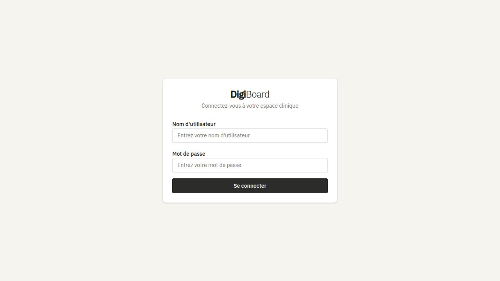

# DigiBoard

Application web de gestion de patients psychiatriques pour les case managers luxembourgeois. Conçue pour le suivi des dossiers, la coordination des soins et la gestion des transitions entre boards cliniques.




---

## Table des matières

1. [Boards cliniques](#boards-cliniques)
2. [Gestion des patients](#gestion-des-patients)
3. [Fiche patient — détail](#fiche-patient--détail)
4. [Outils cliniques](#outils-cliniques)
5. [Évaluations psychométriques](#évaluations-psychométriques)
6. [Notes de réunion](#notes-de-réunion)
7. [Régions ACT](#régions-act)
8. [Statistiques](#statistiques)
9. [Paramètres & Administration](#paramètres--administration)
10. [Stack technique](#stack-technique)
11. [Installation](#installation)
12. [Architecture & API](#architecture--api)

---

## Boards cliniques

Les patients sont répartis en **5 boards cliniques** représentant chaque étape du parcours de soin.

| Board | Description |
|-------|-------------|
| **PréAdmission** | Nouveaux dossiers, informations initiales, premiers contacts |
| **FactBoard** | Suivi actif avec phases de traitement et passages hebdomadaires |
| **RecoveryBoard** | Objectifs de rétablissement, étapes en cours et plan d'action |
| **Irrecevable** | Dossiers non retenus, avec motif d'irrecevabilité |
| **Clôturé** | Dossiers fermés — historique complet conservé |

> Les patients **Clôturés** sont exclus de la vue "Tous" et n'apparaissent que dans leur propre onglet.

### Transitions entre boards
Chaque déplacement est enregistré automatiquement avec la date et les boards source/destination. L'historique complet des transitions est consultable directement depuis la fiche du patient.

Le passage vers **FactBoard** positionne automatiquement la `date d'admission`, et le passage vers **Clôturé** positionne automatiquement la `date de fin de suivi`. Ces dates restent éditables manuellement depuis la fiche.

---

## Gestion des patients

### Liste des patients
La liste latérale affiche pour chaque patient :
- **Ligne 1** : Nom & prénom + codes CIM-10 (si renseignés)
- **Ligne 2** : Numéro client (`FACT-XXXX`) + badge de board
- **Ligne 3** : Psychiatre référent + badge d'agressivité (si > 0)

### Recherche
Recherche en temps réel par nom, prénom, psychiatre ou numéro client. Le filtre s'applique à l'intérieur du board sélectionné ou sur l'ensemble des patients (vue "Tous").

### Création d'un patient
- Numérotation automatique `FACT-XXXX` générée côté serveur
- Formulaire complet avec toutes les informations générales, médicales et administratives
- Recherche et sélection de plusieurs codes CIM-10 par code ou libellé

### Déplacement entre boards
Un patient peut être déplacé vers n'importe quel autre board depuis sa fiche. La transition est horodatée et versée dans l'historique.

### Suppression et restauration
- **Suppression douce** : le patient est masqué de toutes les vues mais conservé en base de données
- **Restauration** : depuis la corbeille dans les Paramètres, le patient est réintégré dans son dernier board connu

---

## Fiche patient — détail

### Informations générales
| Champ | Description |
|-------|-------------|
| Photo | Upload et prévisualisation d'une photo de profil |
| Nom / Prénom | Identité civile |
| Date de naissance | Âge calculé automatiquement |
| Sexe | Homme / Femme |
| Adresse | Adresse complète du patient |
| Téléphone | Numéro de contact |

### Informations médicales
| Champ | Description |
|-------|-------------|
| Pathologies (CIM-10) | Diagnostics multiples — sélecteur multi-codes CIM-10 par code ou libellé |
| Psychiatre | Sélection parmi la liste configurée dans les Paramètres |
| Médecin de famille | Sélection parmi la liste configurée dans les Paramètres |
| Agressivité | Niveau de 0 à 3 avec badge visuel coloré (vert → rouge) |

Chaque code CIM-10 sélectionné est affiché dans la fiche avec son libellé, sa description (si disponible) et sa ligne de **risques cliniques** — toujours visible, en rouge lorsque des risques sont renseignés.

### Informations administratives
| Champ | Description |
|-------|-------------|
| Case Manager principal | Intervenant principal |
| Case Manager secondaire | Intervenant de soutien |
| Article légal | Base juridique applicable |
| Curatelle / Tutelle | Type de mesure de protection |
| Date premier contact | Première prise en charge |
| Date d'admission | Auto-renseignée à l'entrée en FactBoard, éditable manuellement |
| Date de fin de suivi | Auto-renseignée à la clôture du dossier, éditable manuellement |
| Date de sortie | Clôture administrative du dossier |

### FactBoard — champs spécifiques
| Champ | Description |
|-------|-------------|
| Phase de traitement | 6 phases disponibles (Prévention de Crise → Nouveau Client) |
| Passages hebdomadaires | Cases à cocher par jour (Lun–Ven) + rendez-vous spéciaux |

### RecoveryBoard — champs spécifiques
| Champ | Description |
|-------|-------------|
| Objectif | Objectif de rétablissement en cours |
| Étape en cours | Étape actuelle du plan de rétablissement |
| Action planifiée | Prochaine action à entreprendre |

---

## Outils cliniques

### Passages hebdomadaires (FactBoard)
Grille de suivi des passages par semaine. Pour chaque semaine, cochez les jours de présence (Lundi à Vendredi) et/ou indiquez un rendez-vous spécifique. L'historique des passages est conservé.

### Phases de traitement (FactBoard)
Six phases cliniques ordonnées, sélectionnables depuis un menu déroulant :
1. Prévention de Crise
2. Traitement intensif court terme
3. Traitement intensif long terme
4a. Évitement de traitement
4b. Évitement à haut risque
5a. Admission Prison
5b. Admission Psychiatrie
6. Nouveau Client

La liste des patients dans le FactBoard est automatiquement triée par ordre de phase.

### Agressivité
Indicateur de risque à 4 niveaux (0–3) affiché sous forme de badge coloré dans la liste des patients et dans la fiche :
| Niveau | Signification | Couleur |
|--------|--------------|---------|
| 0 | Aucune agressivité | _(pas de badge)_ |
| 1 | Agressivité faible | Vert |
| 2 | Agressivité modérée | Orange |
| 3 | Agressivité élevée | Rouge |

---

## Évaluations psychométriques

### I•ROC (Individual Recovery Outcomes Counter)
Évaluation du bien-être et de la progression vers le rétablissement. Composée de **12 questions** notées de **1 à 6** (1 = Très mauvais → 6 = Excellent), regroupées en 4 domaines HOPE :

| Domaine | Questions | Couleur |
|---------|-----------|---------|
| Domicile | Q1–Q3 | Bleu |
| Opportunité | Q4–Q6 | Vert |
| Personnes | Q7–Q9 | Orange |
| Autonomisation | Q10–Q12 | Violet |

### HoNOS (Health of the Nation Outcome Scales)
Échelle clinique standardisée d'évaluation des outcomes de santé mentale. Composée de **12 questions** notées de **0 à 4** (0 = Aucun problème → 4 = Problème grave), regroupées en 4 groupes cliniques :

| Groupe | Questions | Couleur |
|--------|-----------|---------|
| Comportement | Q1–Q3 | Rouge |
| Déficiences | Q4–Q6 | Ambre |
| Symptômes | Q7–Q9 | Rose |
| Social | Q10–Q12 | Cyan |

Les résultats sont enregistrés avec date, horodatage et auteur. Un champ de notes libres est disponible par évaluation et par question.

### Indicateurs KPI par patient
Depuis la fiche patient, un tableau de bord analytique affiche :
- **Temps passé par board** : durée cumulée dans chaque board (stabilité parcours)
- **Alertes de régression** : détection des retours de RecoveryBoard vers FactBoard
- **Diagrammes radar** : scores I•ROC et HoNOS sous forme de toile d'araignée — chaque axe est coloré selon son domaine clinique, avec superposition d'une évaluation de comparaison sélectionnable et un historique des scores totaux

---

## Notes de réunion

Les notes de réunion sont associées à chaque patient :
- **Ajout** : saisie d'une note avec date et contenu libre
- **Sauvegarde automatique** : enregistrement à la perte du focus (blur)
- **Modification** : édition inline de toute note existante
- **Suppression** : suppression individuelle avec confirmation
- **Historique** : toutes les notes sont conservées et affichées par ordre chronologique

---

## Régions ACT

Module dédié à la gestion des régions ACT (Assertive Community Treatment) :
- Affichage des patients par région ACT
- Notes de réunion propres à chaque région
- Suivi des interventions en milieu communautaire

---

## Statistiques

Tableau de bord analytique global accessible depuis le menu principal. Un filtre de période (1 mois / 6 mois / 12 mois / tout) est disponible sur toutes les métriques.

| Indicateur | Description |
|------------|-------------|
| Total patients | Nombre total de patients dans la période sélectionnée |
| Patients actifs | Patients sur FactBoard, RecoveryBoard ou PréAdmission |
| Répartition par board | Distribution des patients sur les 5 boards |
| Répartition par sexe | Proportion Homme / Femme |
| Répartition par âge | Groupes décennaux (< 70 ans) et 70+ |
| Répartition par agressivité | Nombre de patients par niveau (0–3) |
| Pathologies fréquentes | Codes CIM-10 les plus représentés (multi-diagnostics pris en compte) |
| Durée moyenne par board | Temps moyen de séjour dans chaque board actif, calculé sur tous les mouvements historiques (patients clôturés inclus) |
| Évaluations I•ROC | Nombre d'évaluations I•ROC dans la période (patients supprimés exclus) |
| Évaluations HoNOS | Nombre d'évaluations HoNOS dans la période (patients supprimés exclus) |
| Visites par lieu (ACT) | Nombre de notes ACT par région, triées par fréquence |

---

## Paramètres & Administration

### Listes configurables
Les listes utilisées dans les formulaires patients sont gérables depuis les Paramètres :
| Liste | Description |
|-------|-------------|
| Case Managers | Intervenants principaux et secondaires |
| Psychiatres | Médecins psychiatres référents |
| Médecins de famille | Généralistes |
| Articles légaux | Bases juridiques applicables |
| Curatelles / Tutelles | Types de mesures de protection |

### Codes CIM-10
La base contient **381 codes CIM-10** (chapitre F, troubles mentaux) pré-chargés avec pour chacun :
- **Code** et **libellé** officiel
- **Description** clinique (optionnelle)
- **Risques cliniques** : synthèse concise en français des risques associés au diagnostic — affichés dans la fiche patient et dans les paramètres
- **Favori** (★) : marquage pour accès rapide dans le formulaire de création/modification d'un patient

Depuis les Paramètres il est possible d'**ajouter**, **modifier** ou **supprimer** tout code, et de gérer les favoris.

### Gestion des utilisateurs _(admin uniquement)_
- **Création** de comptes utilisateur avec rôle (Admin / Utilisateur)
- **Modification** : nom, mot de passe, rôle
- **Suppression** de comptes
- **Forçage de changement de mot de passe** : un utilisateur nouvellement créé ou réinitialisé doit définir son mot de passe dès le premier login (sans avoir à fournir l'ancien)

### Corbeille
Restauration des patients supprimés (suppression douce) vers leur dernier board connu.

### Sauvegarde & Restauration
- **Export JSON** : téléchargement de l'intégralité des données (patients, historiques, évaluations I•ROC/HoNOS, notes, codes CIM-10, paramètres)
- **Import JSON** : restauration complète du système depuis un fichier de sauvegarde

---

## Stack technique

| Couche | Technologie |
|--------|-------------|
| Backend | Express 5 (TypeScript) |
| Base de données | PostgreSQL + Drizzle ORM |
| Frontend | React + Vite + Tailwind CSS 4 |
| Composants UI | Radix UI / shadcn/ui |
| État / données | TanStack Query |
| Graphiques | Recharts (RadarChart) |
| Auth | Tokens Bearer (bcrypt) |
| Spécification API | OpenAPI / Swagger |
| Déploiement | Docker + Docker Compose |

---

## Installation

### Développement (pnpm)

```bash
# Prérequis : Node.js 20+, pnpm, PostgreSQL

# Installer les dépendances
pnpm install

# Configurer les variables d'environnement
cp .env.example .env
# Modifier DATABASE_URL et SESSION_SECRET dans .env

# Lancer l'API et le frontend en parallèle
pnpm --filter @workspace/api-server run dev &
pnpm --filter @workspace/factboard run dev
```


> Au premier démarrage, les migrations sont appliquées automatiquement et la base de données est initialisée avec les 381 codes CIM-10.

### Production (Docker)

Prérequis : [Docker](https://docs.docker.com/get-docker/) et [Docker Compose](https://docs.docker.com/compose/) installés sur la machine hôte.

```bash
# 1. Cloner le dépôt
git clone https://github.com/andyelsen85-bit/Fact-DigiBoard.git
cd Fact-DigiBoard

# 2. Créer le fichier de variables d'environnement
cp .env.example .env
```

Éditer `.env` et définir au minimum :

| Variable | Description | Défaut |
|----------|-------------|--------|
| `POSTGRES_PASSWORD` | Mot de passe PostgreSQL | `digiboard_secret` |
| `SESSION_SECRET` | Clé secrète Bearer/session — **changer obligatoirement** | _(valeur faible)_ |
| `APP_PORT` | Port exposé sur l'hôte | `80` |

Générer un `SESSION_SECRET` robuste :
```bash
openssl rand -hex 64
```

```bash
# 3. Construire l'image Docker
docker compose build --no-cache

# 4. Démarrer la stack en arrière-plan (app + PostgreSQL)
docker compose up -d

# 5. Vérifier que les containers tournent correctement
docker compose ps

# 6. Consulter les logs de démarrage
docker compose logs -f app
```

L'application est accessible sur `http://localhost` (ou le port défini par `APP_PORT`).

> Au premier démarrage, les migrations sont appliquées automatiquement et la base est initialisée avec le compte administrateur par défaut et les 381 codes CIM-10 avec leurs risques cliniques.

**Mise à jour :**
```bash
git pull
docker compose build
docker compose up -d
```

**Arrêt :**
```bash
docker compose down          # conserve les données PostgreSQL
docker compose down -v       # supprime aussi le volume (⚠️ perte de données)
```

L'image est construite en multi-stage : dépendances → build TypeScript/Vite → image finale légère.  
L'API et le frontend React sont servis par le même container Express sur le port 80.

---

## Architecture & API

```
workspace/
├── artifacts/
│   ├── api-server/          # API Express 5 (port 8080)
│   │   └── src/routes/      # patients, notes, auth, settings, users, stats, icd10, evaluations, act, backup
│   └── factboard/           # Frontend React + Vite (port 18576)
│       └── src/
│           ├── components/  # PatientList, PatientDetail, PatientModal, PatientKpiView, StatsView…
│           └── pages/       # board.tsx, settings.tsx, statistics.tsx
├── lib/
│   ├── db/                  # Schéma Drizzle ORM + migrations (0000–0009)
│   ├── api-client-react/    # Hooks React Query générés (Orval)
│   └── api-spec/            # Spécification OpenAPI
├── Dockerfile               # Build multi-stage (builder → runner)
└── docker-compose.yml       # Stack complète avec PostgreSQL
```

### Schéma de base de données

| Table | Description |
|-------|-------------|
| `users` | Comptes utilisateurs (id, username, password_hash, role, must_change_password) |
| `sessions` | Tokens Bearer actifs (user_id FK, token, expires_at) |
| `patients` | Dossiers patients complets — voir colonnes ci-dessous |
| `meeting_notes` | Notes de réunion par patient (patient_id FK, date, texte) |
| `history_entries` | Historique des transitions de board (patient_id FK, date, action, board_to, created_by_username) |
| `irock_evaluations` | Évaluations I•ROC q1–q12 (score 1–6), notes, question_notes, created_by_username |
| `honos_evaluations` | Évaluations HoNOS q1–q12 (score 0–4), notes, question_notes, created_by_username |
| `act_regions` | Régions ACT (id, nom) |
| `act_notes` | Notes par région ACT (region_id FK, date, texte) |
| `settings` | Listes configurables clé/valeur |
| `icd10_codes` | 381 codes CIM-10 (code PK, title, description, risks, is_favorite) |

#### Colonnes notables de `patients`

| Colonne | Type | Description |
|---------|------|-------------|
| `client_num` | text | Identifiant `FACT-XXXX` auto-généré |
| `patho` | text | Diagnostic principal (compatibilité historique) |
| `pathos` | jsonb | Liste de codes CIM-10 multiples (source de vérité) |
| `board` | text | Board actuel (PréAdmission / FactBoard / RecoveryBoard / Irrecevable / Clôturé) |
| `board_entry_date` | text | Date d'entrée dans le board actuel |
| `board_days_offset` | jsonb | Ajustement manuel des durées par board (en jours) |
| `date_admission` | text | Date d'admission en FactBoard (auto ou manuelle) |
| `date_fin_suivi` | text | Date de fin de suivi à la clôture (auto ou manuelle) |
| `passages` | jsonb | Grille des passages hebdomadaires |
| `deleted_at` | timestamp | Suppression douce — null = actif |

### Migrations

Les migrations sont appliquées automatiquement au démarrage du serveur via Drizzle ORM.

| Migration | Description |
|-----------|-------------|
| `0000` | Schéma initial : users, patients, meeting_notes, history_entries, act_regions, act_notes, settings, icd10_codes, sessions |
| `0001` | Tables irock_evaluations et honos_evaluations (q1–q10) |
| `0002` | Colonne `created_by_username` sur irock/honos/history |
| `0003` | Questions q11–q12 sur irock_evaluations |
| `0004` | Colonne `board_days_offset` (jsonb) sur patients |
| `0005` | Colonnes `notes` et `question_notes` sur irock/honos |
| `0006` | Colonne `pathos` (jsonb) sur patients + migration des données depuis `patho` |
| `0007` | Colonnes `date_admission` et `date_fin_suivi` sur patients |
| `0008` | Valeur par défaut `Pas connu` pour la colonne `agressivite` |
| `0009` | Risques cliniques renseignés sur les 381 codes CIM-10 (chapitre F00–F99) |

### Endpoints API

#### Authentification
| Méthode | Route | Description |
|---------|-------|-------------|
| `POST` | `/api/auth/login` | Connexion (retourne un token Bearer) |
| `GET` | `/api/auth/me` | Profil de l'utilisateur connecté |
| `GET` | `/api/auth/setup-needed` | Vérifie si la configuration initiale est requise |
| `POST` | `/api/auth/change-password` | Changement de mot de passe (ne requiert pas l'ancien mot de passe si `mustChangePassword=true`) |

#### Patients
| Méthode | Route | Description |
|---------|-------|-------------|
| `GET` | `/api/patients` | Liste des patients actifs (exclut Clôturé et supprimés) |
| `GET` | `/api/patients?board=X` | Filtre par board |
| `GET` | `/api/patients?search=X` | Recherche textuelle |
| `GET` | `/api/patients/:id` | Fiche complète d'un patient |
| `POST` | `/api/patients` | Création (ID FACT- auto-généré) |
| `PATCH` | `/api/patients/:id` | Mise à jour des informations |
| `DELETE` | `/api/patients/:id` | Suppression douce |
| `GET` | `/api/patients/deleted` | Liste des patients supprimés |
| `POST` | `/api/patients/:id/restore` | Restauration d'un patient supprimé |
| `PATCH` | `/api/patients/:id/board` | Changement de board (positionne automatiquement date_admission / date_fin_suivi) |
| `PATCH` | `/api/patients/:id/phase` | Mise à jour de la phase (FactBoard) |
| `PATCH` | `/api/patients/:id/passages` | Mise à jour des passages hebdomadaires |
| `GET` | `/api/patients/:id/history` | Historique des transitions de board |
| `GET` | `/api/patients-selector` | Liste allégée pour les sélecteurs |

#### Notes de réunion
| Méthode | Route | Description |
|---------|-------|-------------|
| `GET` | `/api/patients/:id/notes` | Liste des notes d'un patient |
| `POST` | `/api/patients/:id/notes` | Ajout d'une note |
| `PATCH` | `/api/patients/:id/notes/:noteId` | Modification d'une note |
| `DELETE` | `/api/patients/:id/notes/:noteId` | Suppression d'une note |

#### Évaluations
| Méthode | Route | Description |
|---------|-------|-------------|
| `GET` | `/api/patients/:id/irock` | Historique des évaluations I•ROC |
| `POST` | `/api/patients/:id/irock` | Enregistrement d'une évaluation I•ROC |
| `PATCH` | `/api/patients/:id/irock/:eid` | Mise à jour d'une évaluation I•ROC |
| `DELETE` | `/api/patients/:id/irock/:eid` | Suppression d'une évaluation I•ROC |
| `GET` | `/api/patients/:id/honos` | Historique des évaluations HoNOS |
| `POST` | `/api/patients/:id/honos` | Enregistrement d'une évaluation HoNOS |
| `PATCH` | `/api/patients/:id/honos/:eid` | Mise à jour d'une évaluation HoNOS |
| `DELETE` | `/api/patients/:id/honos/:eid` | Suppression d'une évaluation HoNOS |
| `GET` | `/api/patients/:id/kpi` | KPI de stabilité parcours (durées par board, régressions) |

#### Codes CIM-10
| Méthode | Route | Description |
|---------|-------|-------------|
| `GET` | `/api/icd10` | Liste de tous les codes (code, title, description, risks, isFavorite) |
| `POST` | `/api/icd10` | Création d'un code personnalisé |
| `PATCH` | `/api/icd10/:code` | Modification d'un code |
| `DELETE` | `/api/icd10/:code` | Suppression d'un code |

#### Régions ACT
| Méthode | Route | Description |
|---------|-------|-------------|
| `GET` | `/api/act/regions` | Liste des régions ACT |
| `POST` | `/api/act/regions` | Création d'une région |
| `PATCH` | `/api/act/regions/:id` | Modification d'une région |
| `DELETE` | `/api/act/regions/:id` | Suppression d'une région |
| `GET` | `/api/act/regions/:id/notes` | Notes d'une région |
| `POST` | `/api/act/regions/:id/notes` | Ajout d'une note à une région |
| `PATCH` | `/api/act/regions/:regionId/notes/:noteId` | Modification d'une note ACT |
| `DELETE` | `/api/act/regions/:regionId/notes/:noteId` | Suppression d'une note ACT |

#### Paramètres
| Méthode | Route | Description |
|---------|-------|-------------|
| `GET` | `/api/settings` | Lecture de toutes les listes configurables |
| `PATCH` | `/api/settings` | Mise à jour d'une ou plusieurs listes |

#### Utilisateurs _(admin uniquement)_
| Méthode | Route | Description |
|---------|-------|-------------|
| `GET` | `/api/users` | Liste des utilisateurs |
| `POST` | `/api/users` | Création d'un utilisateur |
| `PATCH` | `/api/users/:id` | Modification d'un utilisateur |
| `DELETE` | `/api/users/:id` | Suppression d'un utilisateur |

#### Statistiques
| Méthode | Route | Description |
|---------|-------|-------------|
| `GET` | `/api/stats` | Statistiques globales — accepte `?since=YYYY-MM-DD` pour filtrer par période |

Réponse : `total`, `active`, `boardCounts`, `sexeCounts`, `pathoCounts`, `aggCounts`, `avgDurations`, `ageCounts`, `irockCount`, `honosCount`, `visitsByLieu`.

#### Sauvegarde
| Méthode | Route | Description |
|---------|-------|-------------|
| `GET` | `/api/backup` | Export JSON complet de la base de données |
| `POST` | `/api/backup/restore` | Restauration depuis un fichier JSON |

---

## Licence

Usage interne — Tous droits réservés.
